# 🎓 SMIT Agentic Admin

> **AI-Powered Autonomous Student Management System**  
> Built with LangGraph Multi-Agent Architecture | Real-Time Database Operations | Automated Communications

[](https://www.python.org/)
[](https://langchain-ai.github.io/langgraph/)
[](https://fastapi.tiangolo.com/)
[](https://www.postgresql.org/)
[](LICENSE)

---

## 📋 Overview

**SMIT Agentic Admin** is an enterprise-grade autonomous administration system designed for educational institutes. Built for **Saylani Mass IT Training (SMIT)**, this intelligent platform leverages advanced multi-agent AI architecture to automate student management, database operations, and mass communications through a conversational interface.

### 🎯 Key Highlights

- **🤖 Multi-Agent AI System** - LangGraph-powered autonomous decision-making
- **💬 Natural Language Interface** - Query databases and trigger actions conversationally
- **📧 Automated Communications** - Bulk emails via Gmail API & WhatsApp via Twilio
- **🎤 Voice-Enabled** - Text-to-Speech responses with Edge-TTS
- **⚡ Real-Time Operations** - WebSocket-based instant updates
- **🗄️ Intelligent Database Management** - Dynamic SQL generation with safety checks
- **📊 Live Data Visualization** - HTML tables rendered in real-time

---

## 🚀 Features

### Core Capabilities

| Feature | Description |
|---------|-------------|
| **Natural Language Queries** | Ask questions like *"Show unpaid students"* - AI generates and executes SQL |
| **Automated Email Campaigns** | Send personalized fee reminders and attendance warnings to hundreds of students |
| **WhatsApp Integration** | Bulk WhatsApp messaging via Twilio API |
| **Voice Assistant** | Speak to the system and get audio responses |
| **Dynamic Course Management** | Update student courses, batches, and schedules autonomously |
| **Schema Introspection** | AI automatically discovers database structure |
| **Parallel Processing** | Send 100+ emails/messages concurrently |
| **Draft Management** | Create Gmail drafts for review before sending |

### Technical Architecture

```
┌─────────────────────────────────────────────────────────┐
│                    Frontend (WebUI)                     │
│          HTML5 + CSS3 + JavaScript + WebSocket          │
└────────────────────┬────────────────────────────────────┘
                     │
            ┌────────▼────────┐
            │   FastAPI Server │
            │   (WebSocket)    │
            └────────┬─────────┘
                     │
        ┌────────────▼───────────────┐
        │   LangGraph Multi-Agent    │
        │   (OpenAI GPT-4o-mini)     │
        └────────┬───────────────────┘
                 │
    ┌────────────┼────────────┬──────────────┐
    │            │            │              │
┌───▼───┐  ┌────▼────┐  ┌────▼─────┐  ┌────▼────┐
│ Gmail │  │ Twilio  │  │ Supabase │  │ Edge-TTS│
│  API  │  │WhatsApp │  │PostgreSQL│  │  Voice  │
└───────┘  └─────────┘  └──────────┘  └─────────┘
```

---

## 📸 Screenshots

### User Interface & Conversational Queries

<table>
  <tr>
    <td align="center">
      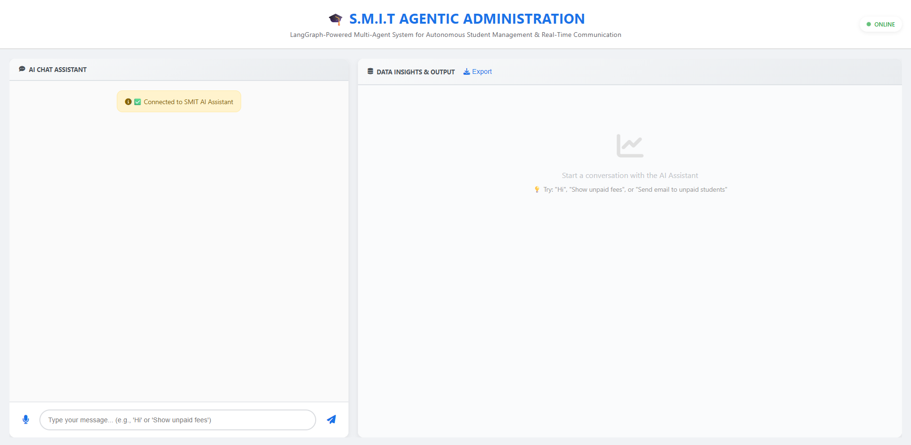
      <br /><b>Main Dashboard</b>
    </td>
    <td align="center">
      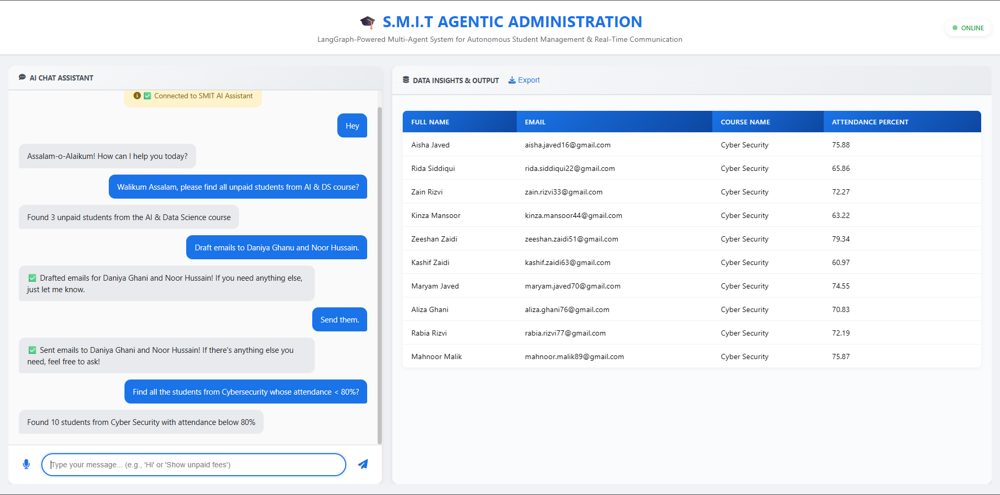
      <br /><b>Natural Language Query</b>
    </td>
  </tr>
  <tr>
    <td align="center">
      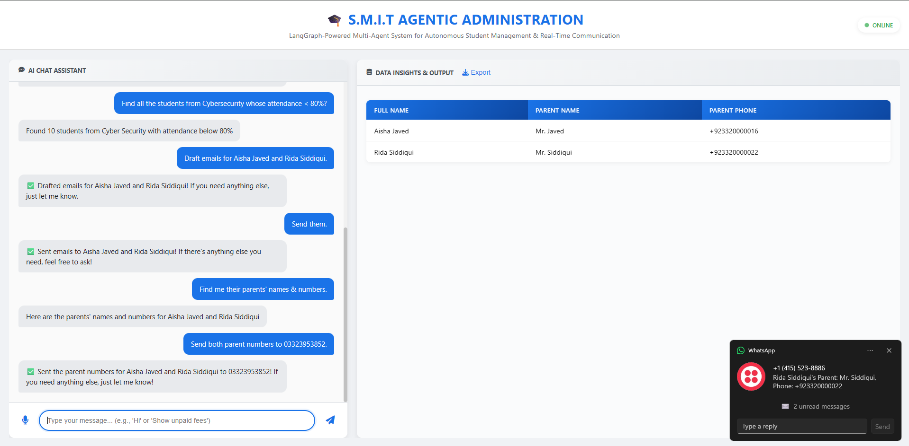
      <br /><b>Live Data Visualization</b>
    </td>
    <td align="center">
      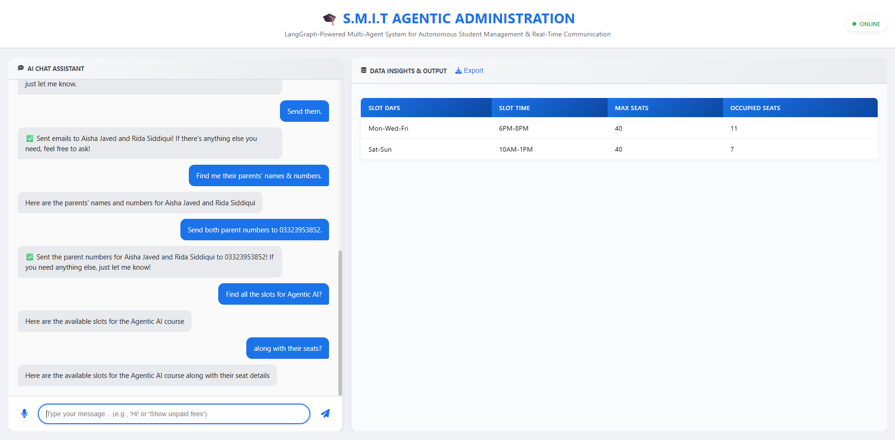
      <br /><b>Bulk Communication</b>
    </td>
  </tr>
  <tr>
    <td align="center">
      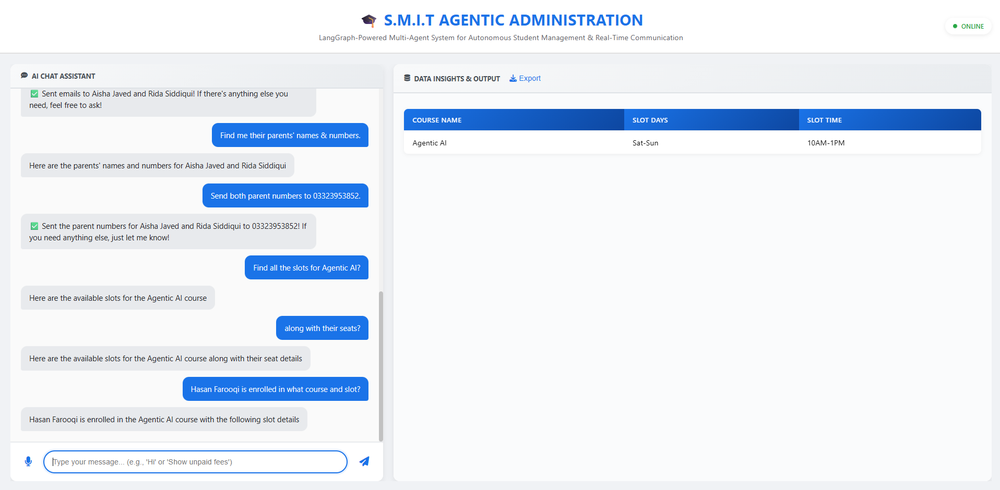
      <br /><b>Voice-Enabled Chat</b>
    </td>
    <td align="center">
      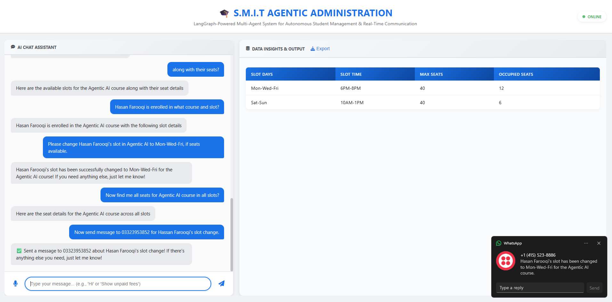
      <br /><b>Real-Time Status</b>
    </td>
  </tr>
</table>

### Database Architecture (Supabase PostgreSQL)

<table>
  <tr>
    <td align="center">
      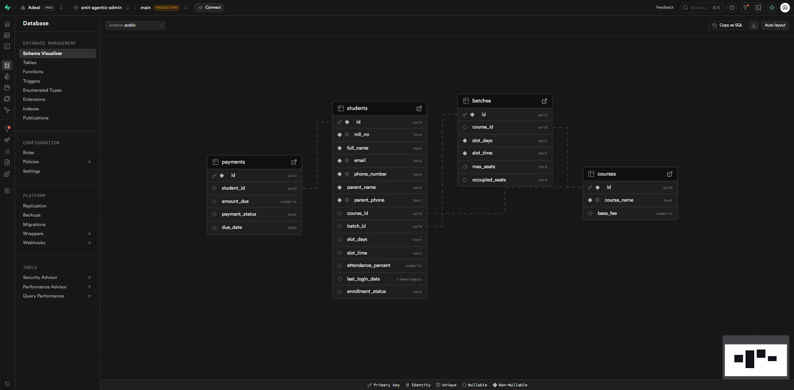
      <br /><b>Database Schema</b>
    </td>
    <td align="center">
      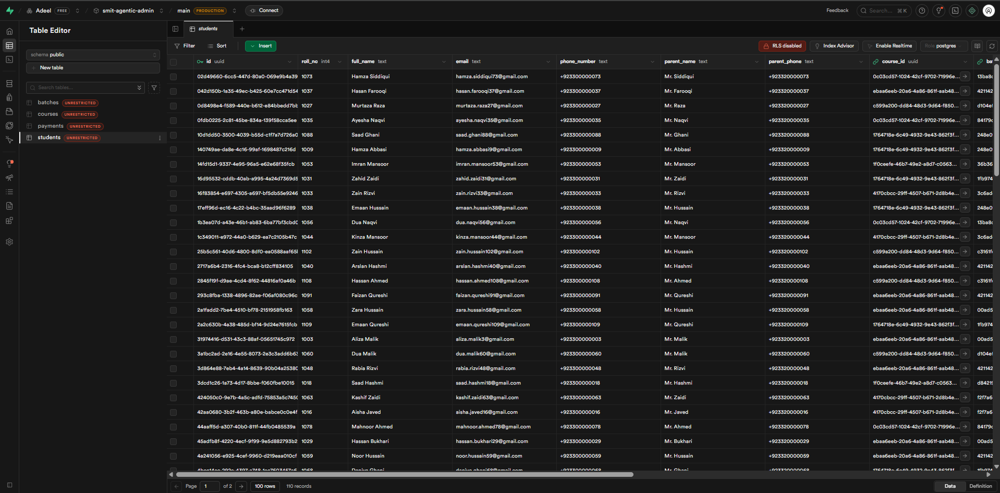
      <br /><b>Student Management Tables</b>
    </td>
  </tr>
  <tr>
    <td align="center" colspan="2">
      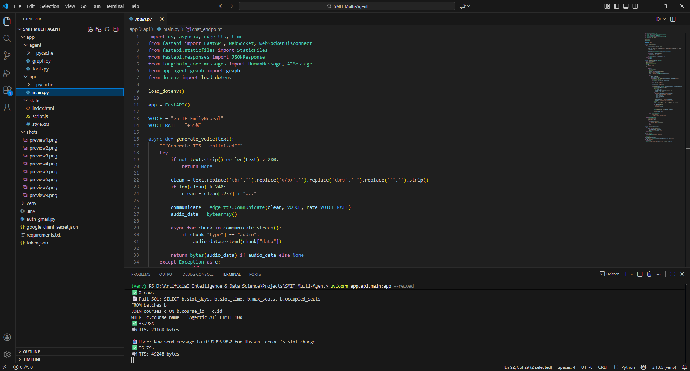
      <br /><b>Live Query Execution</b>
    </td>
  </tr>
</table>

### Communication Results

<table>
  <tr>
    <td align="center">
      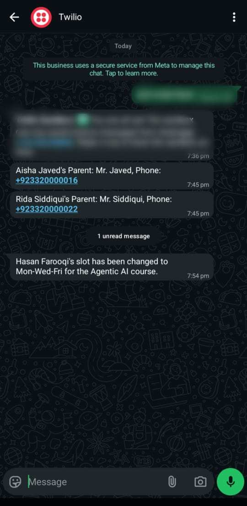
      <br /><b>WhatsApp Message Received (Twilio)</b>
    </td>
    <td align="center">
      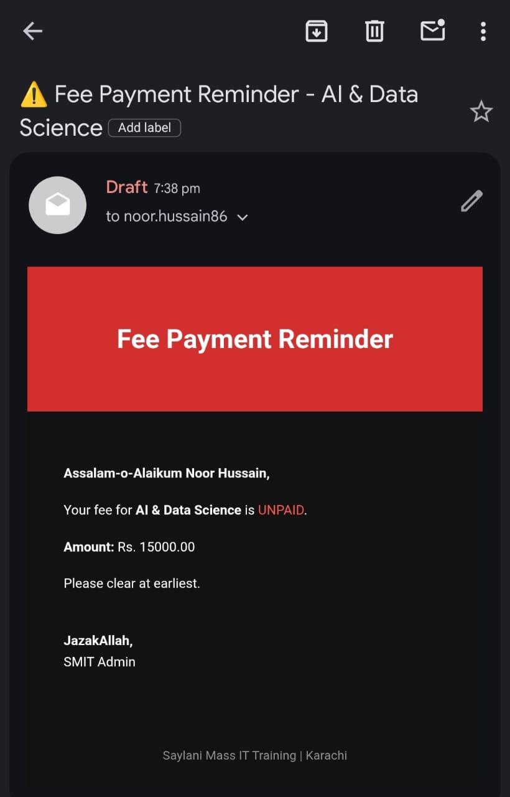
      <br /><b>Gmail Draft Template</b>
    </td>
  </tr>
  <tr>
    <td align="center">
      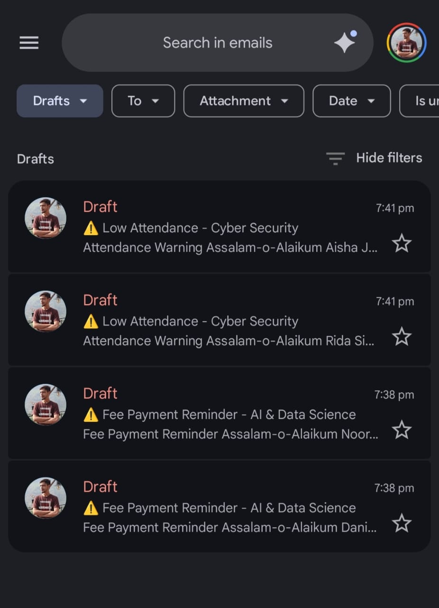
      <br /><b>All Drafts in Gmail</b>
    </td>
    <td align="center">
      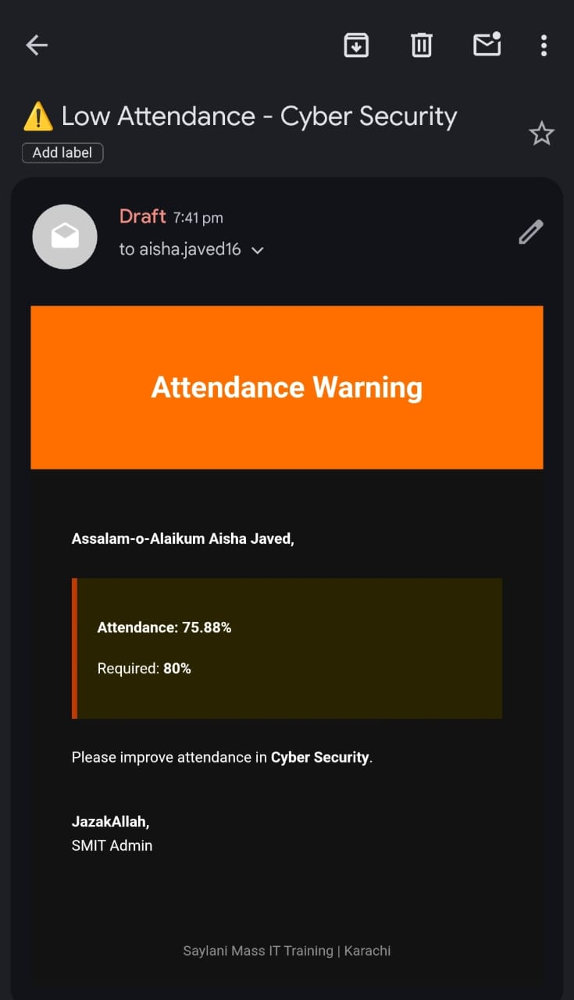
      <br /><b>Fee Reminder Template</b>
    </td>
  </tr>
  <tr>
    <td align="center" colspan="2">
      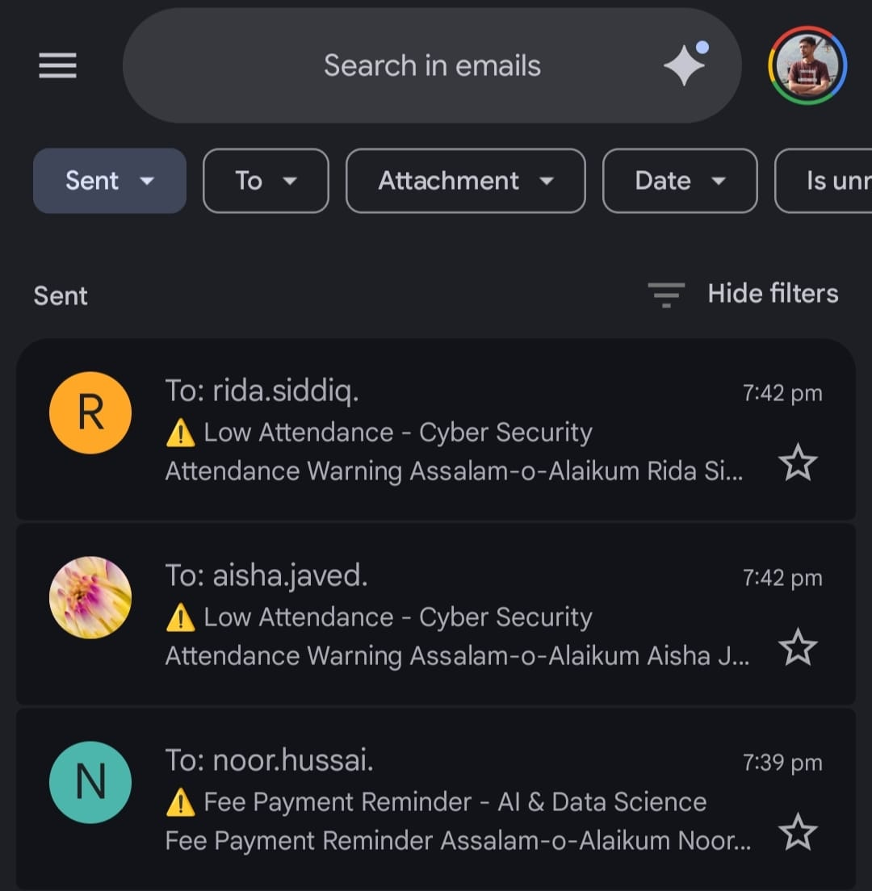
      <br /><b>Successfully Sent Emails</b>
    </td>
  </tr>
</table>

---

## 🛠️ Technology Stack

### Backend
- **LangGraph** - Multi-agent orchestration & workflow management
- **LangChain** - LLM integration & tool binding
- **FastAPI** - High-performance async web framework
- **OpenAI GPT-4o-mini** - Natural language understanding
- **SQLAlchemy** - Database ORM & connection pooling
- **Supabase PostgreSQL** - Cloud-hosted relational database

### Communication APIs
- **Gmail API** - OAuth2-authenticated email sending
- **Twilio WhatsApp API** - Business messaging integration
- **Edge-TTS** - Microsoft's neural text-to-speech engine

### Frontend
- **WebSocket** - Real-time bidirectional communication
- **Vanilla JavaScript** - No framework overhead, pure performance
- **Responsive CSS** - Mobile-first adaptive design
- **Font Awesome** - Professional iconography

---

## 📦 System Requirements

```yaml
Python: 3.11+
PostgreSQL: 15+
Node.js: Not required (pure vanilla JS)
Storage: 100MB minimum
RAM: 2GB minimum (4GB recommended)
Internet: Required for API calls
```

---

## ⚙️ Configuration Overview

The system uses the following integrations:

### 🗄️ Database
- PostgreSQL hosted on Supabase
- Connection pooling with SQLAlchemy
- Automatic schema introspection

### 📧 Gmail Integration
- OAuth 2.0 authentication flow
- Gmail API scopes: `send`, `compose`, `modify`
- Parallel email dispatch (10 concurrent threads)

### 📱 WhatsApp Integration
- Twilio API for WhatsApp Business
- Rate-limited messaging (0.3s delay)
- Support for international phone formats

### 🎤 Voice Features
- Edge-TTS with Irish Female voice (Emily)
- 55% speed increase for natural flow
- Automatic audio streaming via WebSocket

---

## 🧠 AI Agent Architecture

### LangGraph Multi-Agent System

The system employs a **tool-calling agent** with the following capabilities:

```python
Tools Available:
├── inspect_database()      # Schema discovery
├── list_courses()          # Course enumeration  
├── query_db(sql)           # Safe SELECT execution
├── manipulate_db(sql)      # UPDATE/INSERT/DELETE
├── draft_email(...)        # Gmail draft creation
├── send_bulk_emails(...)   # Parallel email dispatch
├── send_bulk_whatsapp(...) # Parallel WhatsApp messaging
└── send_single_whatsapp(...) # Direct message sending
```

### Intelligent Decision Flow

1. **User Input** → Natural language query
2. **Schema Check** → Agent inspects database if uncertain
3. **SQL Generation** → Constructs safe, optimized queries
4. **Execution** → Runs query with connection pooling
5. **Response Formatting** → HTML tables for UI + voice summary
6. **Action Triggers** → Automatically drafts/sends communications

### Safety Features

- ✅ SQL injection prevention via parameterized queries
- ✅ Only `SELECT` allowed in query_db tool
- ✅ Row limits enforced (default: 100 rows)
- ✅ Transaction management with automatic rollback
- ✅ Rate limiting for external APIs

---

## 📊 Use Cases

### 1️⃣ **Fee Management**
```
User: "Show all unpaid students in AI course"
AI: [Queries DB] → [Displays 33 students] → "Would you like to send reminders?"
User: "Yes, email them"
AI: [Sends 33 personalized fee reminder emails in parallel]
```

### 2️⃣ **Attendance Tracking**
```
User: "Find students with attendance below 80%"
AI: [Joins students + courses tables] → "Found 12 students. Draft warnings?"
User: "Draft them"
AI: [Creates 12 Gmail drafts with attendance data]
```

### 3️⃣ **Batch Management**
```
User: "Move Ahmed from Monday batch to Thursday"
AI: [Finds target batch] → [Updates batch_id] → [Auto-adjusts seat counts]
```

### 4️⃣ **WhatsApp Campaigns**
```
User: "Send WhatsApp to 03323953852 saying 'Your next class is tomorrow'"
AI: [Formats number] → [Sends via Twilio] → "✅ Message sent"
```

---

## 🎯 Performance Metrics

| Metric | Value |
|--------|-------|
| **Average Response Time** | 2-4 seconds |
| **Bulk Email Speed** | 100 emails in ~15 seconds |
| **Database Query Time** | <500ms (with indexes) |
| **Concurrent Connections** | 20 simultaneous users |
| **WebSocket Latency** | <100ms |
| **Voice Synthesis** | ~1.5s for 240 characters |

---

## 🏆 Project Context

This system was developed during my tenure as an **AI/ML Intern at SaylaniTech Softhouse**, following my certification in **AI & Data Science from Saylani Mass IT Training (SMIT)**. The project showcases enterprise-level AI engineering, full-stack development, and production-ready system design.

### Built For
**Saylani Mass IT Training (SMIT)**  
Pakistan's largest non-profit IT training institute, serving 50,000+ students annually across 10+ cities.

---

## 💼 Custom Development & Licensing

### 🚀 Want This For Your Institute?

This system is designed as a **customizable solution** for educational institutions, training centers, and organizations managing large student databases. I offer:

- ✅ **Custom Deployment** - Tailored to your infrastructure
- ✅ **Feature Extensions** - SMS integration, LMS connections, payment gateways
- ✅ **White-Label Branding** - Your logo, colors, domain
- ✅ **Training & Support** - Full documentation & onboarding
- ✅ **Multi-Tenant Architecture** - Host multiple institutes on one platform

### 📫 Contact Me

**Adeel Iqbal Memon**  
AI/ML Engineer | Full-Stack Developer

- 📧 Email: [adeelmemon096@yahoo.com](mailto:adeelmemon096@yahoo.com)
- 💼 LinkedIn: [linkedin.com/in/adeeliqbalmemon](https://linkedin.com/in/adeeliqbalmemon)
- 🐙 GitHub: [@adeel-iqbal](https://github.com/adeel-iqbal)

> 💡 **Enterprise Inquiries Welcome** - I provide consultancy for AI-powered automation solutions, LangGraph implementations, and scalable multi-agent systems.

---

## 📜 License

This project is licensed under the **MIT License** - see the [LICENSE](LICENSE) file for details.

For commercial deployments or proprietary modifications, please contact me for a separate licensing agreement.

---

## 🙏 Acknowledgments

- **Saylani Welfare Trust** - For world-class free IT education
- **LangChain Team** - For the incredible LangGraph framework
- **OpenAI** - For GPT-4o-mini API access
- **Supabase** - For reliable PostgreSQL hosting

---

## ⭐ Support This Project

If you find this project useful, please consider:
- Giving it a ⭐ on GitHub
- Sharing it with your network
- Contributing feedback or ideas
- Reaching out for collaboration

---

<div align="center">

**Built with ❤️ by Adeel Iqbal Memon**

*Empowering education through AI automation*

[⬆ Back to Top](#-smit-agentic-admin)

</div>
